# Macker

A **Docker Desktop replacement** built on Apple's native container runtime
([`apple/container`](https://github.com/apple/container)). It ships a native
macOS SwiftUI GUI **and** a CLI shim you can symlink as `docker` /
`docker-compose`, plus a custom Compose engine with service-name DNS and hot
reload for virtiofs bind mounts.

> Containers run as lightweight Linux VMs on Apple Silicon via
> Virtualization.framework — no Docker daemon, no Docker Desktop license, no
> gRPC/NIO dependency.

---

## Table of Contents

- [Features](#features)
- [How it works](#how-it-works)
- [Requirements](#requirements)
- [Installation](#installation)
- [Usage](#usage)
  - [GUI](#gui)
  - [CLI](#cli)
  - [Docker compatibility](#docker-compatibility)
- [Documentation](#documentation)
- [License](#license)

---

## Features

- **Native macOS GUI (SwiftUI)** — Dashboard, Containers, Images, Builds,
  Volumes, Networks, Compose, Activity Monitor and Settings.
- **Docker-compatible CLI** — one binary, two modes. Symlink it as `docker`
  and `docker-compose` for drop-in compatibility.
- **Custom Compose engine** — YAML parser, `${VAR}` interpolation, `.env`
  support, topological `depends_on` resolution, config-hash recreation,
  service-name DNS via `/etc/hosts`, and health-check gating.
- **Hot reload** — FSEvents → synthetic inotify bridge so Vite/webpack/nodemon
  rebuild when you edit files on the host (virtiofs does not propagate inotify).
- **Menu bar extra** — CPU/memory rings, per-container quick actions, and
  customizable metrics.
- **Storage management** — prune images, delete the buildkit builder, and full
  cleanup from the GUI or CLI.

---

## How it works

`apple/container` exposes a private XPC API (`container-apiserver`). Apple
Docker talks to it through a lightweight XPC client — no gRPC, no NIO, no
daemon of its own. Operations that have no XPC route (image build, pull, push,
tag, prune) fall back to the `container` CLI.

The single `macker` binary dispatches on its arguments:

- **No arguments** → launches the SwiftUI GUI.
- **With arguments** → runs the headless CLI (ArgumentParser).

---

## Requirements

- **macOS 15+** (Sequoia or later)
- **Apple Silicon** (arm64)
- [apple/container](https://github.com/apple/container) installed and running
  (`container-apiserver`). The protocol version is pinned to **1.2.2** in
  `Package.swift` — client and runtime ship in lockstep.

---

## Installation

### Option A — Homebrew (recommended)

```bash
brew install --cask djpfs/tools/macker
```

Installs the `Macker.app` bundle into `/Applications` (Launchpad/Spotlight
discoverable). The cask lives in the
[`homebrew-tools`](https://github.com/djpfs/homebrew-tools) tap and points to
the latest stable `.pkg` from GitHub Releases.

To use the CLI as a drop-in `docker` replacement, symlink the bundled binary:

```bash
ln -s /Applications/Macker.app/Contents/MacOS/macker /usr/local/bin/docker
ln -s /Applications/Macker.app/Contents/MacOS/macker /usr/local/bin/docker-compose
```

### Option B — Install the CLI to your PATH

```bash
make install
```

This installs `/usr/local/bin/macker`. To use it as a drop-in `docker`
replacement:

```bash
ln -s /usr/local/bin/macker /usr/local/bin/docker
ln -s /usr/local/bin/macker /usr/local/bin/docker-compose
```

> The GUI also has a **Settings → Install CLI** button that does the same thing
> (with an administrator password prompt).

### Option C — Install the app bundle

Build a `.pkg` installer and install it into `/Applications`:

```bash
./Scripts/build-pkg.sh 1.0.0
open dist/Macker-1.0.0.pkg
```

Or, from the GUI, use **Settings → Install app in /Applications** to copy the
app bundle into `/Applications` (Launchpad/Spotlight discoverable).

### Option D — Build from source

```bash
git clone https://github.com/<you>/macker.git
cd macker
make build          # debug build
```

---

## Usage

### GUI

```bash
macker
```

The GUI provides:

- **Dashboard** — resource cards, daemon status, and CPU/memory/I/O charts with
  configurable time intervals.
- **Containers** — list with search, start/stop/restart, and a detail pane with
  Info / Stats / Logs / Terminal / Files / Settings tabs.
- **Images** — list, pull, and delete (with confirmation).
- **Builds** — build history, build an image from a context, retry failed
  builds, copy the build command, and prune the build cache.
- **Volumes / Networks** — create, inspect, and delete.
- **Compose** — load compose files (including drag & drop), up/down, logs, and
  per-project actions.
- **Activity Monitor** — per-container resource usage.
- **Settings** — menu bar customization, storage cleanup, install CLI/app,
  launch at login, and more.

### CLI

```bash
docker version
docker selftest
docker system status
docker ps
docker compose up -d
```

### Docker compatibility

Because the binary is meant to be symlinked as `docker`, unknown top-level
subcommands are transparently routed to the docker shim. So these are
equivalent:

```bash
docker ps
macker ps
```

---

## Screenshots

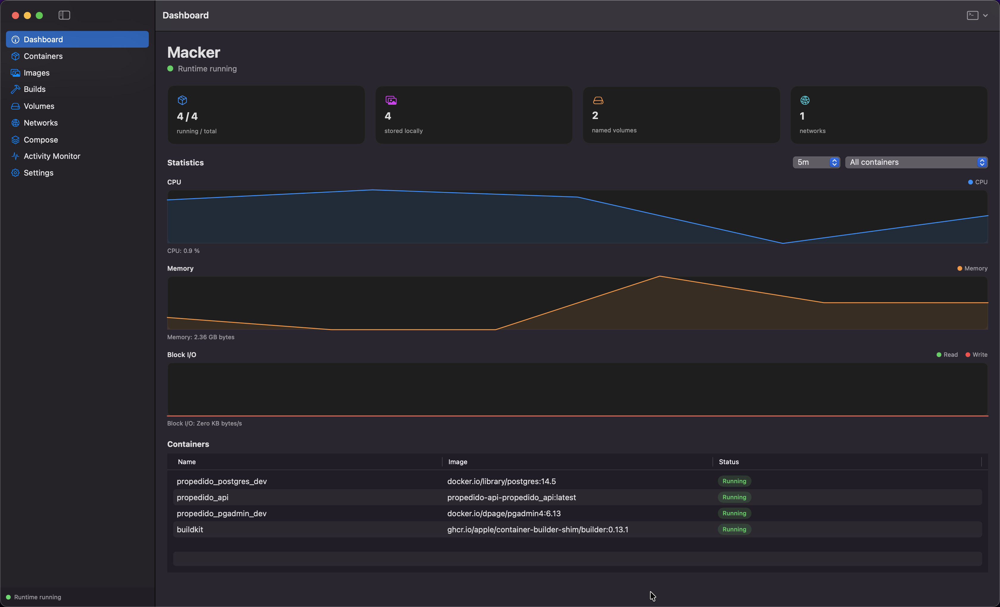
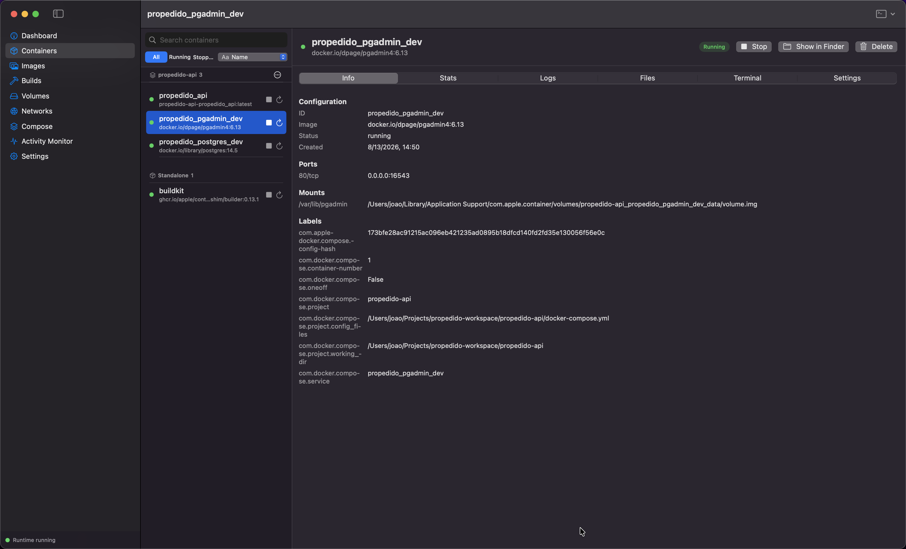
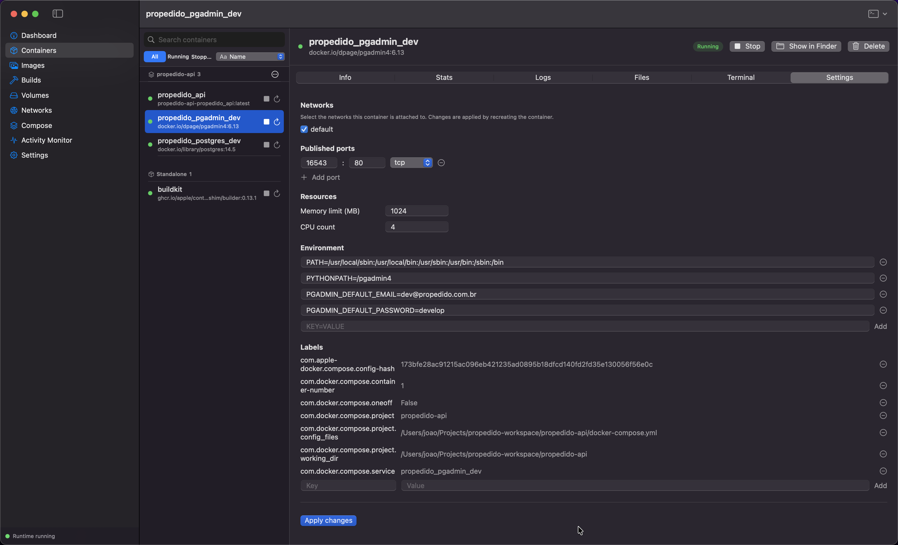
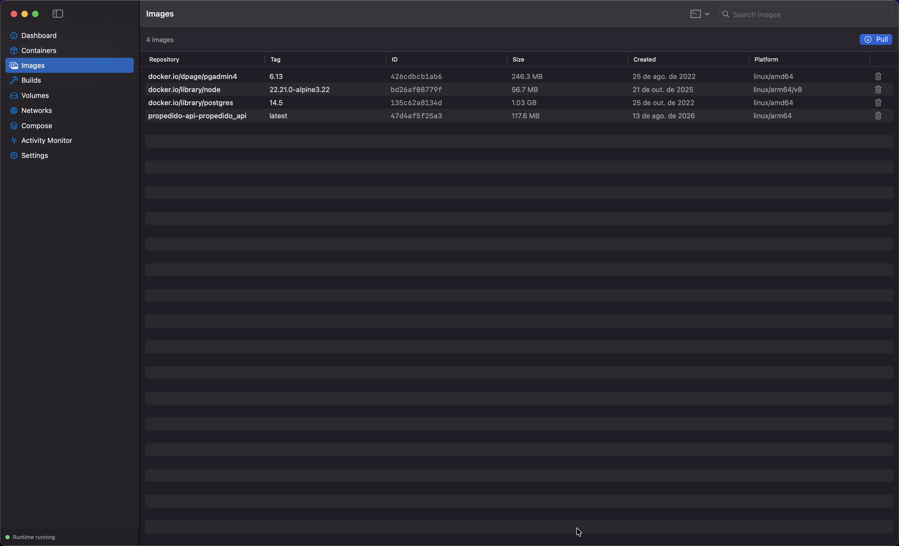
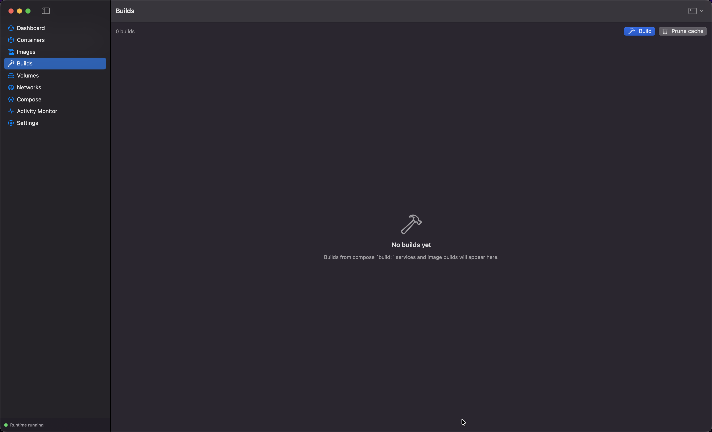
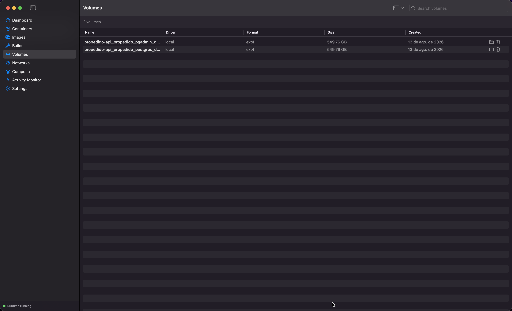
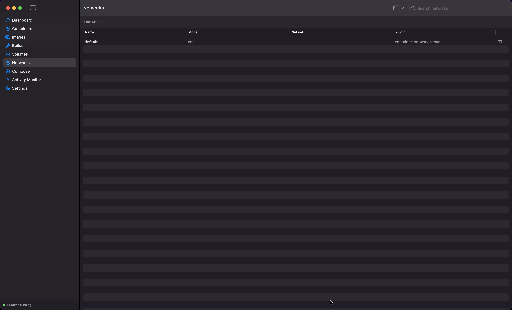
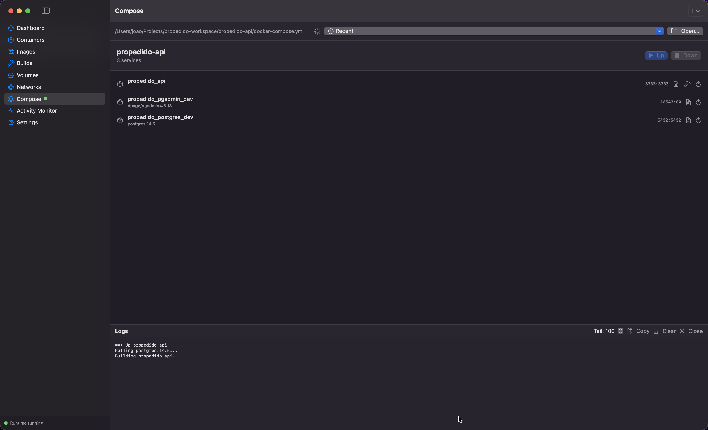
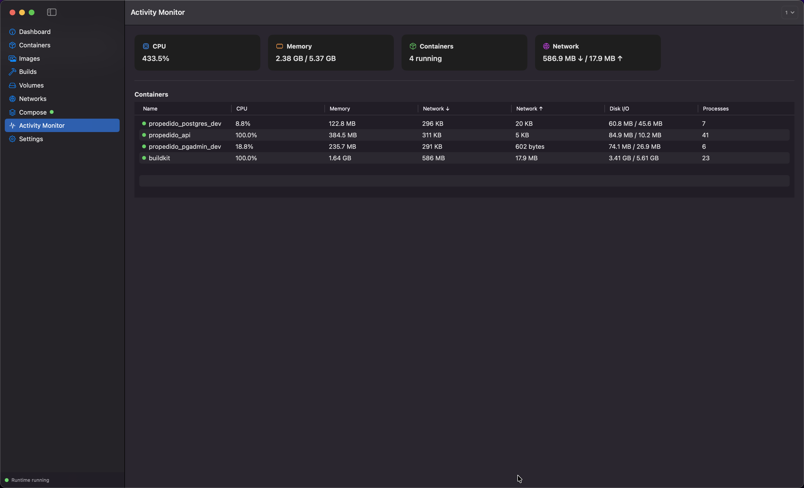
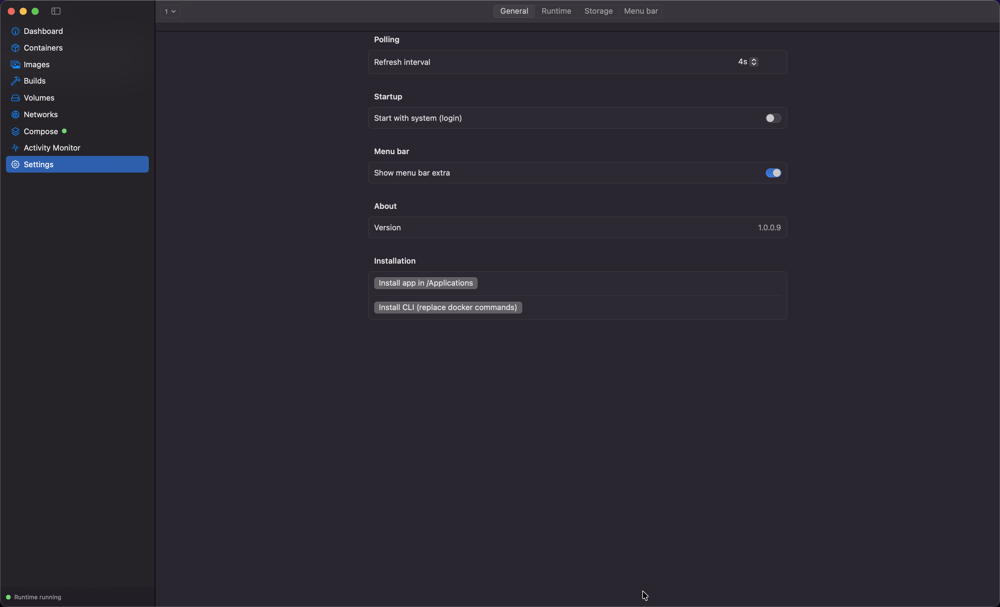
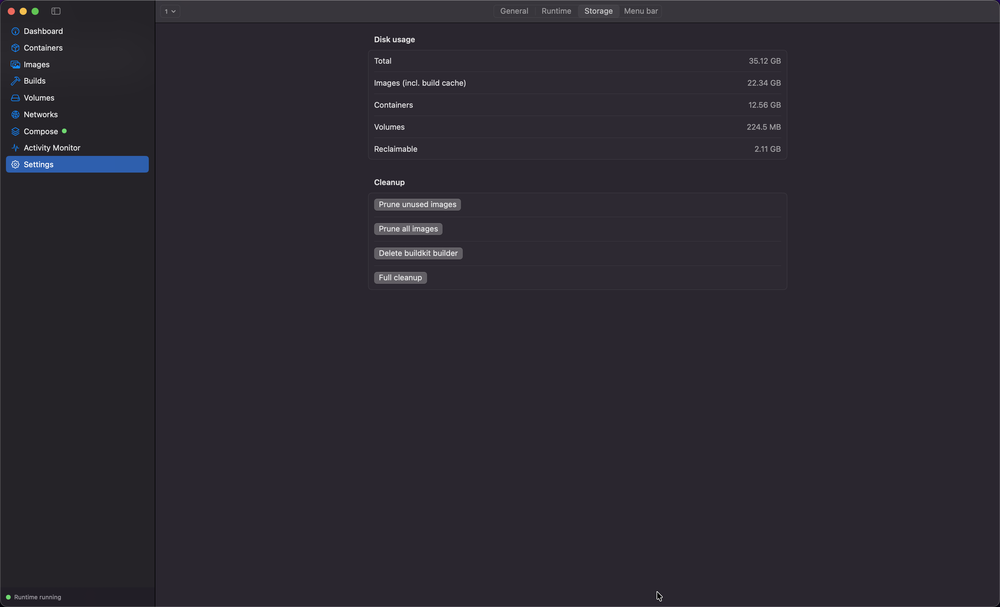
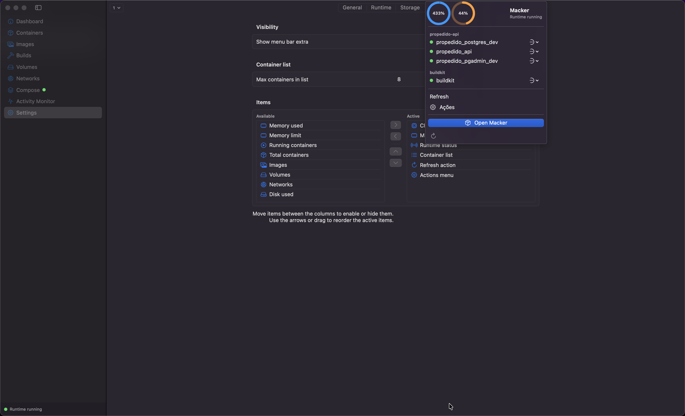
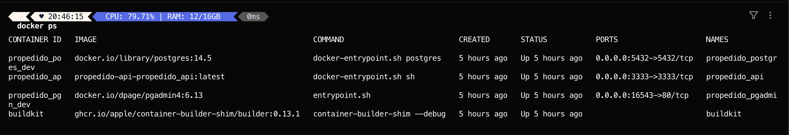
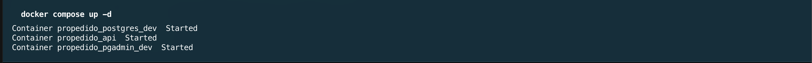

## Documentation

- [Architecture](docs/ARCHITECTURE.md) — layers, modules, and how they fit together.
- [Supported commands](docs/COMMANDS.md) — full `docker` and `docker compose` reference.
- [Compose engine & hot reload](docs/COMPOSE-ENGINE.md) — how `docker compose up` works and the virtiofs inotify bridge.
- [GUI features](docs/GUI.md) — menu bar and storage & cleanup.
- [Security](docs/SECURITY.md) — security policy and notes.
- [Contributing](docs/CONTRIBUTING.md) — development setup, code style, testing, releasing.
- [Roadmap & limitations](docs/ROADMAP.md) — known limitations and planned improvements.

---

## License

[MIT](LICENSE) © 2026 macker contributors
